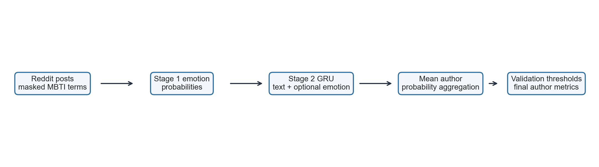

# AC 209b Final Project - Project 66

This folder is organized for both human review and LLM-assisted work. Agents should read `AGENTS.md` first. Markdown files are the default project memory; original notebooks, slides, PDFs, screenshots, and DOCX files live under `artifacts/` for verification.

## MS4 Pipeline Snapshot

The final MS4 pipeline treats Reddit users as the prediction unit. Posts are masked for direct MBTI leakage, split by author, converted into frozen MiniLM text embeddings and text-derived emotion probabilities, and evaluated through author-level models. The main result comes from the set/attention author model; real emotion is tested against shuffled-emotion and control baselines rather than treated as an independent causal signal.

## Provenance

The Markdown layer is based on:

- original course/project artifacts under `artifacts/`
- submitted MS2/MS3 notebooks and slides
- presenter notes and slide planning notes already present in the folder
- TA feedback and team clarifications
- the KaggleHub API access check recorded in `data/README.md`

Sections labeled as recommendations, carry-forward notes, or agent instructions are synthesis for future work, not claims of original course wording.

## Project Snapshot

- **Course:** AC 209b / CS 1090b, Spring 2026
- **Canvas project number:** 66
- **Team:** Harry Hu, Tom Shan, Wendy Wang, Kemeng Zhang
- **Topic:** Emotion-informed MBTI prediction from Reddit writing
- **Current state:** Milestones 0-3 are historical/submitted materials. Milestone 4 has implemented corrected GRU/TF-IDF baselines, frozen MiniLM author probes, and set/attention author-transformer experiments with tracked report-ready results.

## Core Research Question

Do text plus emotion-informed features improve author-level prediction of the four binary MBTI dimensions (`E/I`, `N/S`, `F/T`, `J/P`) over direct text-only baselines?

## Human Read Order

1. `docs/llm_project_context.md` - compact project briefing.
2. `data/README.md` - dataset sources and API loading instructions.
3. `milestones/README.md` - milestone-by-milestone status.
4. The relevant milestone README, `requirements.md`, and `notebook_summary.md` when present.

## Folder Map

| Path | Purpose |
|---|---|
| `data/` | Dataset source notes and API loading instructions. |
| `docs/course/` | Course-level notes; original syllabus and milestone overview screenshot are under `docs/course/artifacts/`. |
| `milestones/ms0_project_proposal/` | Proposal Markdown, MS0 requirements Markdown, and original artifacts. |
| `milestones/ms1_group_formation/` | Group formation notes, requirements Markdown, and original artifacts. |
| `milestones/ms2_data_wrangling_project_redefinition/` | MS2 summaries, presenter notes, TA feedback, requirements, and original artifacts. |
| `milestones/ms3_eda_baseline_pipeline/` | MS3 summaries, slide text, presenter script, TA feedback, requirements, and original artifacts. |
| `milestones/ms4_final_modeling_deliverables/` | Final modeling work area with the executed MS4 notebook, helper code, report result files, and video/report planning notes. |

## Version Rules

- Markdown files are the main project memory.
- `artifacts/submitted/` contains original submitted notebooks and slide files.
- `artifacts/drafts/` contains earlier iterations.
- `artifacts/requirements_*.png` are requirement screenshots kept for visual verification.
- `docs/course/artifacts/` contains original course-level PDF/PNG references.
- For MS2, `notes/ms2_presenter_script_part_1_2.md` is important because slides omit spoken detail.
- For MS3, `notes/ms3_presenter_script.md` and `notes/ms3_slide_plan.md` are important context even though they were not submitted.

## MS4 Immediate Next Step

Before writing or revising final code/report text, read:

- `milestones/ms4_final_modeling_deliverables/README.md`
- `milestones/ms4_final_modeling_deliverables/modeling_notebook_design.md`
- `milestones/ms3_eda_baseline_pipeline/README.md`
- `data/README.md`

The current MS4 design keeps the completed corrected GRU/TF-IDF layer as baseline evidence, then adds transformer author representations to test the main question more rigorously. The key claim is not causal emotion prediction: emotion probabilities are text-derived transferred representations. The main comparison is matched `text + real emotion` versus `text-only`, checked against shuffled-emotion negative controls and activity/length controls. The robust result is the 200-post set/attention author formulation; after seeded reruns and train-only scaling for controls, the emotion-specific conclusion is cautious rather than a standalone improvement claim.
